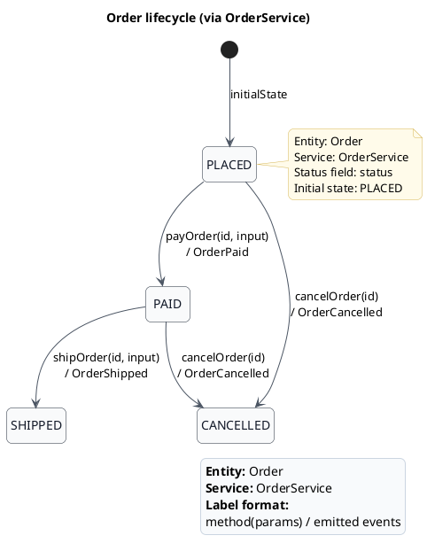

ZenWave Domain Language (ZDL) started with a simple goal: help me think about software, talk about it, validate and create a shared understanding, and then generate the boring parts that are already present in the model.

Grounded on DDD principles for describing bounded contexts as part of event-driven architectures, including domain entities and their relationships, services with inbound commands and domain events, documenting business rules (policies), and even creating rich domain aggregates.

The language was designed to be compact, readable and expressive. Developer friendly, machine friendly and business friendly in the sense that can be read and understood by all stakeholders.

The language is flexible enough to state machines for entities, rich aggregates, and services... so the decision was not to create dedicated syntax for state machines, but to reuse the existing annotations for entities, aggregates and services, but postprocess this lifecycle annotations on the parser itself.

## Why State Machines Matter?

State Machines matters in DDD for a few reasons:

- First, state machines make behaviour explicit. Without them, the lifecycle is hidden in scattered if statements across services, handlers, and validations. The rules exist, but nobody can see them in one place.
- Second, they protect aggregate invariants. An aggregate is supposed to be the boundary that keeps business rules consistent. If transitions are modeled as state changes explicitly, it is easier to prevent invalid moves such as cancelling an already delivered order or shipping an unpaid one.
- Also, they help connect commands and domain events. For example, `placeOrder` moves `Order` from `DRAFT` to `PLACED` and emits `OrderPlaced`. That makes the relation between state change and event much clearer.
- And more important, because they create **shared understanding**. State machines are easy to discuss with business experts and other stakeholders because they describe behaviour in business terms: what state something is in, what can happen next, and what that means.

In short, state machines matter because they make lifecycle, invariants, transitions, and emitted business events explicit, which is exactly the kind of behaviour DDD tries to model well.


## How ZenWave ZDL supports State Machines

The way ZenWave ZDL supports state machines is deceptively simple: it uses two decorators (annotations) `@lifecycle` and `@transition` that can be attached to entities/aggreates and commands respectively.

### With Services (Lightweight Aggregates pattern)

If you are using the **Lightweight Aggregates** pattern, where your business logic is implemented in services, you can use the `@lifecycle` decorator on the entity and the `@transition` decorator on the service commands.

If you follow a **service-based (lightweight aggregate)** approach, lifecycle is defined on the entity and transitions on service commands.


```zdl
@aggregate
@lifecycle(field: status, initial = DRAFT)
entity Order {
    orderNumber String required unique maxlength(36)
    status OrderStatus required
}

enum OrderStatus {
    DRAFT, PLACED, PAID, SHIPPED, CANCELLED
}

service OrderService for (Order) {
    @transition(from: DRAFT, to: PLACED)
    placeOrder(PlaceOrderInput) Order withEvents OrderPlaced

    @transition(from: [DRAFT, PLACED, PAID], to: CANCELLED)
    cancelOrder(CancelOrderInput) Order withEvents OrderCancelled
}
```


### With Rich Aggregates

If your business logic lives in the aggregate itself, put `@lifecycle` on the aggregate or root entity and `@transition` on the aggregate commands:

```zdl
entity Order { }

@lifecycle(field: status, initial = DRAFT)
aggregate OrderAggregate (Order) {
    @transition(from: DRAFT, to: PLACED)
    placeOrder(PlaceOrderInput) withEvents OrderPlaced
    @transition(from: [DRAFT, PLACED, PAID], to: CANCELLED)
    cancelOrder(CancelOrderInput) withEvents OrderCancelled
}
```

If you choose to add `@transition` in to your service commands, ZenWave SDK will generate extra validation logic also in your services to ensure that the state transitions are valid before executing the command.

## What This Enables

With this model, the DSL becomes the place where lifecycle is defined once and then automatically enforced. The SDK generates transition validation, consistent state mutation, and domain events aligned with each state change. And as a bonus, lifecycle diagrams in PlantUML, so the model documents itself.

But the thing I like most is this: it works without forcing a specific implementation style. You can start with services and lightweight aggregates today, and move to rich aggregates later, the lifecycle model stays the same.

Define the rules once. Let the generator do the rest. That is the whole idea.

## Example: From DSL to Code

This is not just documentation. The state machine is enforced in the generated code.

```zdl
@rest("/orders")
service OrderService for (Order) {

    /** Customer places an order */
    @post
    placeOrder(PlaceOrderInput) Order withEvents OrderPlaced

    /** Set Order as paid */
    @post("/{orderNumber}/pay")
    @transition(from: PLACED, to: PAID)
    payOrder(@natural id, PayOrderInput) Order withEvents OrderPaid

    /** Set Order as shipped */
    @post("/{orderNumber}/ship")
    @transition(from: PAID, to: SHIPPED)
    shipOrder(@natural id, ShipOrderInput) Order withEvents OrderShipped

    /** Set Order as cancelled */
    @post("/{orderNumber}/cancel")
    @transition(from: [PLACED, PAID], to: CANCELLED)
    cancelOrder(@natural id) Order withEvents OrderCancelled

    /** Query order */
    @get("/{orderNumber}")
    getOrder(@natural id) Order?
}
```

Here is the lifecycle for the previous example in PlantUML:




And this is the kind of code generated from the DSL:

```kotlin
override fun cancelOrder(orderNumber: String): Order {
    log.debug("Request cancelOrder: {}", orderNumber)

    val existingOrder =
        orderRepository.findByOrderNumber(orderNumber)
            ?: throw NoSuchElementException("Order not found with id: orderNumber=$orderNumber")
    // Transition validation
    requireState(existingOrder.status, OrderStatus.PLACED, OrderStatus.PAID)
    existingOrder.status = OrderStatus.CANCELLED
    val order = orderRepository.save(existingOrder)

    // emit events
    eventsProducer.onOrderCancelled(eventsMapper.asOrderCancelled(order))
    return order
}
```

The transition is validated, the state is updated, and the domain event is emitted. All derived from the model.

If you want to see the full example:

- Sample project: https://github.com/ZenWave360/zenwave-playground/blob/main/examples/order-fulfillment-kotlin
- Docs: https://www.zenwave360.io/docs/examples/ddd-examples/order-fullillment-kotlin/

This is the idea: define the behaviour once in the model, and let the system enforce it everywhere.
