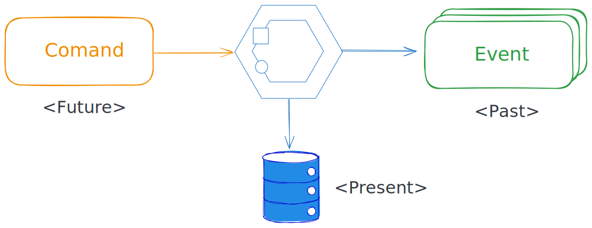
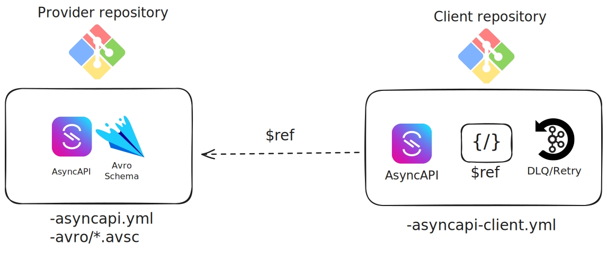

The [AsyncAPI v3 specification](https://www.asyncapi.com/docs/reference/specification/v3.1.0) says:

> The AsyncAPI document SHOULD describe the operations an application performs.

That "SHOULD" opens the door. Not all operations belong in the same file. Before the solution, a few concepts need to be clear.

## Events and commands

Regarding the intention of asyncronous messages, we can differentiate Events from Commands and Responses.

Events are facts. Something happened. `OrderCreated`. `PaymentAuthorized`. They are named in the past tense, owned by the application that produced them, and broadcast for anyone who cares to react.

Commands are requests. Do something. `ValidateDocument`. `SendNotification`. They are addressed to a specific application, which may accept or reject them. Sometimes they require an specific directed Response message.



## Provider and client roles

Regarding the role an application plays, we can differentiate the provider of a feature from its clients.

A **provider** is the application that owns a specific capability. Ownership shows up in two ways: it is the authoritative source of some data being published, or it is the one that performs requested actions on behalf of others. The Orders service owns the order lifecycle: `OrderCreated` is its data to publish because no other application has the right to declare that an order was created. When another service sends a `CancelOrder` command, it goes to Orders because Orders is the only application that can carry out that action. That is why it is the provider for that topic.

A **client** is any application that uses a capability it does not own. The same Orders service subscribes to `PaymentAuthorized` from Payments and sends a `ReserveStock` command to Inventory. For those topics, Orders has no authority. It is consuming data and requesting actions that belong to someone else.

Provider and client are topic-level roles, or more precisely operation-level roles. The same application is a provider for the topics it owns and a client for everything else it depends on.

Provider and client differ from producer and consumer depending on the intention of a specific message, whether it is a domain event or an async command.

- A **provider** consumes async commands and produces domain events and command responses.
- A **client** on the other hand produces command requests and consumes domain events and command responses.

That distinction is what makes "provider" and "client" more useful than "producer" and "consumer" for modeling with AsyncAPI.


One note on scope: this distinction applies to business domain events and command channels where a single application is the clear authority. Some technical notification patterns have multiple producers and multiple consumers and do not fit the provider/client frame cleanly. Model those accordingly. The pattern here is for business domain semantics.

## Broker mediated APIs have mirror symmetry

In REST APIs, client and server roles are obvious. A client sends a request. A server handles it. The contract belongs to the server. No ambiguity about who owns what.

Broker-mediated APIs are different. The same channel can be seen as a publication or a subscription, depending on which side you observe from. The broker sits in between, and technically both producer and consumer are clients of the broker, not of each other.


This mirror symmetry is a common source of confusion. How do you define an async API? From which point of view? Do you need two separate specs for the same message?

There are a few strategies, each with tradeoffs:

- **Two independent complete specs.** One per side. No ambiguity about point of view, but every channel definition is duplicated. Two sources of truth for the same thing.
- **One neutral spec for channel and message only.** No duplication, but you lose operation metadata: who publishes, who consumes, group IDs, principal names.
- **One spec from the provider's point of view, with clients inferring the inverse.** The provider publishes a single, self-contained spec with no external `$ref`s. This is the public API surface. Clients read it and know what to do on their side.
- **Two specs, one per side, with the client referencing the provider's spec via `$ref`.** Clean ownership, no duplication, but requires canonical URLs and tooling that can resolve external references across repos.

The last option offers the best tradeoff. It avoids naive duplication and preserves information about who publishes and consumes. Most importantly, it keeps the provider spec self-contained and free of external `$ref`s.

> The provider spec is the public contract. Keep it self-contained and free of external `$ref`s. Clients reference it; it references nothing.

A provider spec with no external references is simpler to publish, simpler to validate, and simpler to consume. That is the recommended starting point.

## Two surfaces, two files

If you put all of this in a single AsyncAPI document, the boundary disappears. You end up with a flat list of channels and operations where readers must infer which contracts this application owns and which belong to others. That inference gets harder as the system grows.

The cleaner model is two files.

`asyncapi.yml` describes what this application provides: the events it publishes, the commands it accepts, the channels it owns. This is the public contract. Other teams depend on it. It belongs in your schema registry. When it changes, that change is deliberate and goes through whatever governance process your organization runs for breaking changes.

`asyncapi-client.yml` describes what this application consumes: the channels it subscribes to, the messages it reads, the commands it sends outward. This is the internal view. It is useful for the team building and operating the application, but it carries no contract obligations to anyone else.



The names can vary. `asyncapi-public.yml` and `asyncapi-internal.yml`. `asyncapi-provider.yml` and `asyncapi-consumer.yml`. Pick what reads well for your team. What matters is the separation, not the label.

## What they look like

The Orders provider spec is self-contained. One domain event. No external references. Everything any consumer needs is in this file.

```yaml
# asyncapi.yml (Orders service, provider)
asyncapi: 3.1.0
info:
  title: Orders Service
  version: 1.0.0

channels:
  orderCreated:
    address: orders.events.order-created
    messages:
      OrderCreated:
        $ref: '#/components/messages/OrderCreated'

operations:
  publishOrderCreated:
    action: send
    channel:
      $ref: '#/channels/orderCreated'

components:
  messages:
    OrderCreated:
      payload:
        type: object
        properties:
          orderId: { type: string }
          customerId: { type: string }
          createdAt: { type: string, format: date-time }
```

The Payments service consumes that event. Its client file does not redefine the channel. It references the entire channel from the Orders provider spec: address, messages, bindings, all of it.

```yaml
# asyncapi-client.yml (Payments service, client of Orders)
asyncapi: 3.1.0
info:
  title: Payments Service (Client)
  version: 1.0.0

channels:
  orderCreated:
    $ref: '<orders-service-asyncapi-url>#/channels/orderCreated'

operations:
  onOrderCreated:
    action: receive
    channel:
      $ref: '#/channels/orderCreated'
```

The only thing the client adds is the `receive` operation. The channel definition, including the topic address and the message schema, belongs to Orders, and the client points to it.

The placeholder `<orders-service-asyncapi-url>` is where the decision lives.

## Reference, but what exactly?

The client and the provider are maintained by different teams and evolve at their own pace. The client references the provider spec, but what exactly does it point to?

There are three distinct strategies, and each one answers a different question.

| Strategy | Question |
| -------- | -------- |
| Pinned version (`v1.1.0`) | What version was this designed against? |
| Production alias (`prod`) | What is currently deployed? |
| Integration alias (`main`) | What is the current accepted contract? |

These are not interchangeable. Switching strategies does not improve the answer. It changes the question being asked.

Pin to a version and drift is invisible: the client accumulates stale assumptions without noticing. If you track `prod` you can not perform coordinated parallel deployments, client service alway have to wait for provider spec to be in production. If you trac an integration alias like `main` you can more easily perform parallel deployments but you loose track of which environment it is already available, if at all.

This is no easy question.

The [next post](/articles/asyncapi-canonical-references/) works through each strategy, its constraints, and the tradeoffs, and arrives at a concrete recommendation.

## Conclusion

A service has two perspectives:

* what it offers
* what it needs

Modeling them separately makes the boundary between both explicit.
